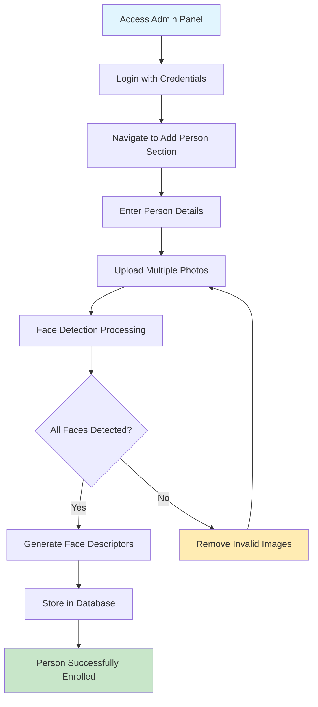
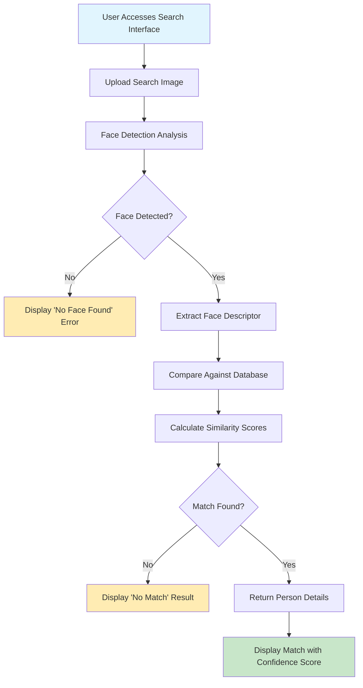

# 🎯 xsukax Face Recognition Web Application Installer


A comprehensive, privacy-focused face recognition application that enables secure identification and management of individuals through advanced facial detection technology. Built with modern web technologies and designed for self-hosted deployment, ensuring complete data sovereignty and privacy protection.

## Project Overview

The xsukax Face Recognition System is a full-stack web application that provides intelligent facial recognition capabilities for personal, organizational, or security use cases. The system combines state-of-the-art machine learning models with a user-friendly interface to deliver accurate face detection, enrollment, and identification services.

**Core Capabilities:**
- **Real-time Face Detection**: Utilizes advanced neural networks for precise facial feature extraction
- **Multi-face Database Management**: Comprehensive system for enrolling and managing multiple individuals
- **Instant Recognition Search**: Upload any photo to instantly identify known individuals
- **Administrative Control Panel**: Secure interface for database management and system administration
- **Responsive Web Interface**: Modern, mobile-friendly design accessible from any device

**Technical Architecture:**
- **Backend**: Node.js with Express.js framework providing RESTful API services
- **Face Recognition Engine**: @vladmandic/face-api powered by TensorFlow.js for client-side ML processing
- **Database**: SQLite for reliable, file-based data persistence
- **Frontend**: Vanilla JavaScript with modern CSS for optimal performance
- **Image Processing**: HTML5 Canvas API for efficient image manipulation

## Security and Privacy Benefits

### Data Sovereignty and Privacy Protection

**🔒 Complete Local Data Control**
- All facial recognition processing occurs entirely on your local infrastructure
- No external API calls or cloud dependencies for core face recognition functionality
- Face descriptors and personal data remain exclusively on your servers
- Zero data transmission to third-party services or external recognition providers

**🛡️ Comprehensive Security Architecture**

1. **Authentication and Access Control**
   - Admin panel protected by secure session-based authentication
   - Cryptographically secure session tokens generated using Node.js crypto module
   - Session management with automatic token validation and expiration
   - Unauthorized access attempts are logged and blocked

2. **Input Validation and Sanitization**
   - Strict file type validation (images only) with MIME type verification
   - File size limitations (15MB max) to prevent resource exhaustion attacks
   - SQL injection protection through parameterized queries with better-sqlite3
   - Cross-site scripting (XSS) prevention through proper output encoding

3. **Secure File Handling**
   - Uploaded images stored with randomized UUIDs to prevent directory traversal
   - Image files isolated in dedicated directories with restricted access permissions
   - Automatic cleanup of orphaned files during person deletion operations
   - Secure temporary file handling during upload processing

**🔐 Privacy-First Design Principles**

- **Biometric Data Protection**: Face descriptors stored as mathematical vectors, not raw biometric images
- **Configurable Data Retention**: Complete control over how long facial data is retained
- **Audit Trail**: All administrative actions logged with timestamps for accountability
- **Secure Communication**: Application designed to run behind HTTPS reverse proxies
- **No Analytics or Tracking**: Zero integration with external analytics or tracking services

### Enterprise-Grade Security Features

**Database Security**
- SQLite database with write-ahead logging (WAL) for data integrity
- Foreign key constraints ensuring referential integrity
- Automatic backup capabilities through simple file-based approach
- Encryption-at-rest possible through file system level encryption

**Network Security**
- Configurable port binding with automatic port conflict resolution
- Built-in health check endpoints for monitoring and load balancer integration
- Rate limiting capabilities through reverse proxy integration
- CORS protection and secure header configuration

## Features and Advantages

### Advanced Facial Recognition Technology

**🧠 State-of-the-Art ML Models**
- **SSD MobileNetV1**: Optimized single-shot detector for fast face detection
- **68-Point Facial Landmarks**: Precise facial feature mapping for enhanced accuracy
- **128-Dimensional Face Descriptors**: High-precision facial encoding for reliable identification
- **Configurable Similarity Thresholds**: Adjustable matching sensitivity (default: 0.52)

**⚡ Performance Optimizations**
- **Efficient Model Loading**: One-time model initialization with persistent caching
- **Optimized Image Processing**: Canvas-based image manipulation for minimal memory usage
- **L2 Distance Calculations**: Fast, mathematically accurate similarity scoring
- **Batch Processing Support**: Multiple image uploads per person for improved accuracy

### User Experience Excellence

**🎨 Modern Interface Design**
- **Glassmorphism UI**: Contemporary design with blur effects and transparency
- **Responsive Layout**: Seamless experience across desktop, tablet, and mobile devices
- **Drag-and-Drop Support**: Intuitive file upload with visual feedback
- **Real-time Previews**: Instant markdown rendering for notes and descriptions
- **Progressive Loading**: Smooth animations and loading states for all operations

**🔧 Administrative Power Tools**
- **Markdown-Enabled Notes**: Rich text support with live preview for detailed person profiles
- **Bulk Image Management**: Add multiple photos per person for enhanced recognition accuracy
- **Real-time Statistics**: Live dashboard showing database metrics and system status
- **Comprehensive Search**: Advanced filtering and sorting capabilities for large datasets

### Technical Advantages

**🚀 Deployment Simplicity**
- **One-Command Installation**: Automated setup script handles all dependencies
- **Multi-Platform Support**: Compatible with Ubuntu, Debian, CentOS, RHEL, and Fedora
- **Automatic Dependency Resolution**: Intelligent detection and installation of required packages
- **Zero-Configuration Startup**: Automatic port detection and service initialization

**🔧 Maintainability and Extensibility**
- **Clean Codebase**: Well-documented, modular architecture for easy customization
- **API-First Design**: RESTful endpoints enable integration with external systems
- **Database Abstraction**: Simple SQLite schema easily portable to other databases
- **Logging and Monitoring**: Comprehensive error handling and operational visibility

**📈 Scalability Considerations**
- **Efficient Resource Usage**: Optimized for both low-power devices and high-performance servers
- **Horizontal Scaling Ready**: Stateless design enables load balancer deployment
- **Database Performance**: Indexed queries and optimized schema for fast lookups
- **Memory Management**: Garbage collection optimized for long-running processes

## Installation Instructions

### System Requirements

**Minimum Hardware Specifications:**
- CPU: 2 cores, 2.0 GHz (x64 architecture)
- RAM: 4 GB (8 GB recommended for optimal performance)
- Storage: 2 GB available disk space
- Network: Internet connection for initial model downloads

**Supported Operating Systems:**
- Ubuntu 18.04 LTS or newer
- Debian 10 (Buster) or newer
- CentOS 7 or newer
- Red Hat Enterprise Linux 7+
- Fedora 30 or newer

**Required System Packages (automatically installed):**
- Node.js 18+ (LTS version)
- Python 3.6+
- Build tools (gcc, make, etc.)
- Image processing libraries (Cairo, Pango, JPEG, GIF)
- SQLite 3
- Network utilities (iproute2)

### Quick Installation

**Step 1: Download the Installer**
```bash
# Download the installation script
curl -O https://raw.githubusercontent.com/xsukax/xsukax-Face-Recognition-Installer/refs/heads/main/xsukax-Face-Recognition.sh

# Make the script executable
chmod +x xsukax-Face-Recognition.sh
```

**Step 2: Run the Installation**
```bash
# Standard installation with default settings
./xsukax-Face-Recognition.sh

# Custom installation with specific directory and port
./xsukax-Face-Recognition.sh --dir /opt/face-recognition --port 8080

# Installation without system package installation (if dependencies already present)
./xsukax-Face-Recognition.sh --no-install
```

**Installation Command Options:**
- `--dir PATH`: Specify custom installation directory (default: `~/face-recognition-app`)
- `--port N`: Set preferred starting port number (default: 3000)
- `--no-install`: Skip system package installation for pre-configured environments
- `--help`: Display detailed usage information

### Advanced Installation Options

**Custom Directory Installation:**
```bash
# Install to system directory
sudo ./xsukax-Face-Recognition.sh --dir /opt/face-recognition

# Install to user-specific location
./xsukax-Face-Recognition.sh --dir ~/.local/share/face-recognition
```

**Network Configuration:**
```bash
# Specify custom port range
./xsukax-Face-Recognition.sh --port 5000

# The installer automatically finds the first available port starting from your specified port
```

**Offline Installation Preparation:**
```bash
# Pre-download Node.js packages (requires internet)
npm cache add @tensorflow/tfjs-node@^4.22.0
npm cache add @vladmandic/face-api@1.7.15
npm cache add express@^4.21.2
# ... other dependencies
```

### Post-Installation Verification

**Health Check:**
```bash
# Verify the application is running
curl http://localhost:3000/api/health

# Expected response:
# {"status":"ok","modelsLoaded":true,"backend":"tensorflow","timestamp":"2025-01-XX...","version":"2.0.0"}
```

**Service Management:**
```bash
# View application logs
tail -f ~/face-recognition-app/server.log

# Stop the service
pkill -f "node server.js"

# Restart the service
cd ~/face-recognition-app && PORT=3000 node server.js &
```

## Usage Guide

### Initial System Setup

**Step 1: Access the Admin Panel**
1. Navigate to `http://your-server-ip:3000/admin`
2. Enter the default admin password: `xsukax`
3. **Important**: Change the default password by modifying the `ADMIN_PASSWORD` variable in `server.js`

**Step 2: Security Configuration**
```javascript
// Edit server.js to customize the admin password
const ADMIN_PASSWORD = 'your-secure-password-here';

// Restart the application after password changes
```

### Person Enrollment Workflow



**Detailed Enrollment Process:**

1. **Person Information Entry**
   - **Full Name**: Enter the person's complete name (required)
   - **Notes**: Add detailed descriptions using Markdown formatting
     - Support for **bold**, *italic*, headers, lists, quotes, and code blocks
     - Live preview shows formatted output
     - Use for roles, departments, contact information, or security clearance levels

2. **Photo Upload Guidelines**
   - **Image Requirements**: JPG, PNG, or GIF formats up to 15MB each
   - **Quality Recommendations**: 
     - High resolution (minimum 640x480 pixels)
     - Good lighting conditions
     - Clear, unobstructed face view
     - Multiple angles for improved accuracy
   - **Quantity**: Upload 3-10 photos per person for optimal recognition performance

3. **Automatic Processing**
   - Face detection runs automatically on each uploaded image
   - Invalid images (no detectable faces) are automatically rejected
   - 128-dimensional face descriptors generated and stored
   - Original images saved with UUID filenames for security

### Face Recognition Search Process



**Search Interface Features:**

1. **Image Upload Methods**
   - **Drag and Drop**: Drag image files directly onto the upload area
   - **Click to Browse**: Traditional file browser selection
   - **Real-time Validation**: Immediate feedback on file type and size

2. **Recognition Results**
   - **Match Information**: Person name, notes, and confidence percentage
   - **Photo Gallery**: Thumbnail grid of enrolled photos for visual verification
   - **Confidence Scoring**: Percentage match confidence (higher = more certain)
   - **Markdown Rendering**: Rich text display of person notes and details

3. **No-Match Handling**
   - Clear indication when no matching person is found
   - Suggestion to enroll new person if appropriate
   - Error handling for invalid images or processing failures

### Administrative Functions

**Person Management:**
- **Edit Person Details**: Update names, notes, and add additional photos
- **Bulk Image Addition**: Add multiple new photos to existing persons
- **Person Deletion**: Complete removal including all associated images and data
- **Search and Filtering**: Quick navigation through large databases

**System Monitoring:**
- **Database Statistics**: Real-time count of enrolled persons and total images
- **System Health**: Model loading status and application performance metrics
- **Activity Logging**: Administrative actions tracked with timestamps

**Data Export and Backup:**
```bash
# Backup the entire database
cp ~/face-recognition-app/data/faces.db ~/backup/faces-backup-$(date +%Y%m%d).db

# Backup person images
tar -czf ~/backup/images-backup-$(date +%Y%m%d).tar.gz ~/face-recognition-app/person_images/
```

### API Integration

**Health Check Endpoint:**
```bash
GET /api/health
# Response: {"status":"ok","modelsLoaded":true,"backend":"tensorflow","version":"2.0.0"}
```

**Search API:**
```bash
POST /api/search
Content-Type: multipart/form-data

# Form data: searchImage (file)
# Response: {"matches":[{"name":"John Doe","distance":0.32,"confidence":68.0}]}
```

**Admin API Endpoints:**
```bash
# Authentication required for all admin endpoints
Authorization: Bearer <token>

GET /api/persons          # List all persons
GET /api/person/:id       # Get person details
POST /api/person          # Add new person
PUT /api/person/:id       # Update person
DELETE /api/person/:id    # Delete person
```

### Performance Optimization

**System Tuning:**
- **Model Caching**: Models loaded once at startup for optimal performance
- **Database Indexing**: Optimized queries for fast person lookup
- **Image Compression**: Automatic optimization of stored images
- **Memory Management**: Efficient cleanup of processed images

**Scaling Considerations:**
```bash
# For high-traffic deployments, consider:
# 1. Reverse proxy with Nginx
# 2. Load balancing across multiple instances
# 3. Database optimization for large datasets
# 4. CDN for static assets
```

### Troubleshooting Common Issues

**Model Loading Problems:**
```bash
# Verify model files are present
ls -la ~/face-recognition-app/models/

# Re-download models if corrupted
rm -rf ~/face-recognition-app/models/*
# Re-run installer to download fresh models
```

**Port Conflicts:**
```bash
# Check what's using the port
ss -tlnp | grep :3000

# Start with different port
PORT=8080 node server.js
```

**Performance Issues:**
```bash
# Monitor resource usage
top -p $(pgrep -f "node server.js")

# Check application logs
tail -f ~/face-recognition-app/server.log
```

## Licensing Information

This project is licensed under the **GNU General Public License v3.0** (GPL-3.0), ensuring that the software remains free and open source for all users.

### License Summary

**You are free to:**
- ✅ **Use** the software for any purpose, including commercial applications
- ✅ **Study** how the program works and modify it to suit your needs
- ✅ **Distribute** copies of the original software to help others
- ✅ **Improve** the program and release your enhancements to benefit the community

**Under the following terms:**
- 📋 **Share Alike**: Any modifications or derivative works must also be licensed under GPL-3.0
- 🔓 **Source Code**: You must provide source code when distributing the software
- 📄 **License Notice**: Include the original license and copyright notices
- 🚫 **No Warranty**: The software is provided "as-is" without warranties of any kind

### Third-Party Dependencies

This project incorporates several open-source libraries, each with their own licenses:

- **@vladmandic/face-api** (MIT License): Face recognition ML models and utilities
- **@tensorflow/tfjs-node** (Apache 2.0): TensorFlow.js runtime for Node.js
- **Express.js** (MIT License): Web application framework
- **Better-SQLite3** (MIT License): SQLite database interface
- **Canvas** (MIT License): HTML5 Canvas API implementation for Node.js
- **Multer** (MIT License): Middleware for handling multipart/form-data
- **Marked** (MIT License): Markdown parser and compiler

### Commercial Use

The GPL-3.0 license permits commercial use of this software. Organizations may:
- Deploy the system for internal face recognition needs
- Integrate it into larger security or identification systems
- Offer services based on the technology

**Requirements for commercial deployment:**
- Provide source code to users upon request
- Maintain GPL-3.0 licensing for any modifications
- Include proper attribution and license notices

### Contributing

Contributions to this project are welcome and encouraged. By contributing, you agree that your contributions will be licensed under the same GPL-3.0 terms.

**For the complete license text, see:** [GNU GPL v3.0](https://www.gnu.org/licenses/gpl-3.0.en.html)

---

**Installation Support:** For technical assistance, please review the troubleshooting section or submit issues through the project repository.

**Security Notice:** This software handles biometric data. Ensure compliance with applicable privacy laws and regulations in your jurisdiction, including GDPR, CCPA, and local biometric privacy statutes.
